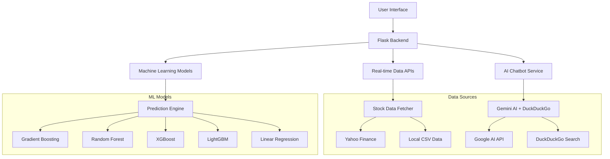

# 📈 AI-Powered Stock Prediction Platform

<div align="center">


**A sophisticated web application for stock market analysis, prediction, and AI-powered financial insights**

</div>

## 🚀 Overview


The **AI-Powered Stock Prediction Platform** is a comprehensive web application that combines machine learning predictions with real-time stock data, AI chatbot assistance, and interactive visualizations. Built with Flask, this platform offers professional-grade stock analysis for Indian and global markets.

## Data Flow Journey 🚀


## 🏗️ Architecture



## 🛠️ Tech Stack
| Backend | Machine Learning | Frontend | APIs & Services |
|--------|-----------------|----------|----------------|
| Flask 2.3+ | scikit-learn | Bootstrap 5 | Yahoo Finance |
| Flask-Login | LightGBM | Plotly.js | Google Gemini API |
| Werkzeug Security | XGBoost | Font Awesome 6 | DuckDuckGo (ddgs) |
| SQLAlchemy | pandas | Mobile-first design | OpenAI GPT-3.5/4 *(opt)* |
| SQLite / PostgreSQL | numpy |  |  |


## 📋 Installation

### Prerequisites
- Python 3.8+
- pip package manager
- API keys (optional): Google Gemini, OpenAI

### Step-by-Step Setup

```bash
# 1. Clone the repository
git clone https://github.com/yourusername/stock-prediction-platform.git
cd stock-prediction-platform

# 2. Create virtual environment
python -m venv venv

# 3. Activate virtual environment
# On Windows:
venv\Scripts\activate
# On macOS/Linux:
source venv/bin/activate

# 4. Install dependencies
pip install -r requirements.txt

# 5. Configure environment variables
cp .env.example .env
# Edit .env file with your API keys (optional)

# 6. Initialize the database
python -c "from app import init_database; init_database()"

# 7. Run the application
python app.py
```

### Configuration File (.env)
```env
FLASK_CONFIG=development
SECRET_KEY=your-secret-key-here
DATABASE_URL=sqlite:///stock_predict.db

# Optional API Keys
OPENAI_API_KEY=your-openai-api-key
GEMINI_API_KEY=your-google-gemini-key
```

## 🎯 Usage Guide

### 1. **Dashboard Navigation**
```
Home → Dashboard → Stock Selection → Analysis View
```

### 2. **Stock Analysis Workflow**
1. **Browse Stocks**: View all available stocks with current prices
2. **Select Stock**: Click any stock card for detailed analysis
3. **Choose Model**: Select from 5 ML prediction models
4. **Set Timeframe**: 1-360 day predictions
5. **View Insights**: Interactive charts and technical indicators

### 3. **AI Chatbot Commands**
```
"Show me Reliance stock analysis"
"What's the market trend for IT stocks?"
"Compare TCS and Infosys performance"
"Explain RSI indicator"
"Get latest news about HDFC Bank"
```

### 4. **Comparison Features**
- **Side-by-side Analysis**: Compare up to 10 stocks simultaneously
- **Performance Metrics**: 30-day returns, volatility, confidence scores
- **Sector Analysis**: Filter by banking, IT, energy, etc.
- **Trend Identification**: Spot market leaders and laggards

## 📊 Supported Stocks

The platform includes 25+ major Indian stocks:

| Category | Stocks Included |
|----------|----------------|
| **Banking** | HDFC Bank, ICICI Bank, SBI, Kotak Bank, Axis Bank |
| **IT** | TCS, Infosys, HCL Tech, Wipro |
| **Energy** | Reliance, ONGC, NTPC, Coal India |
| **Automobile** | Tata Motors, Mahindra, Maruti |
| **FMCG** | ITC, Hindustan Unilever |
| **Healthcare** | Sun Pharma |
| **Infrastructure** | Larsen & Toubro, UltraTech Cement |
| **Others** | Bharti Airtel, Bajaj Finance, Titan, Adani |


## 📈 Performance Metrics

| Model | Accuracy | Training Time | Best For |
|-------|----------|---------------|----------|
| Gradient Boosting | 85-90% | Fast | General predictions |
| Random Forest | 82-88% | Medium | Volatile markets |
| XGBoost | 86-91% | Fast | Large datasets |
| LightGBM | 84-89% | Very Fast | Real-time predictions |
| Linear Regression | 75-82% | Instant | Baseline analysis |

## 🛡️ Security Features

- **Password Hashing**: BCrypt-based password security
- **Session Management**: Secure Flask sessions
- **SQL Injection Protection**: SQLAlchemy ORM
- **API Rate Limiting**: Built-in request throttling
- **Input Validation**: Comprehensive form validation

## 🔄 API Endpoints

| Endpoint | Method | Description |
|----------|--------|-------------|
| `/api/predict` | GET | Stock price predictions |
| `/api/stock-data` | GET | Historical stock data |
| `/api/chat` | POST | AI chatbot queries |
| `/api/comparison_data` | GET | Multi-stock comparison data |
| `/api/chatbot/status` | GET | Chatbot service status |

## 📄 License

This project is licensed under the MIT License - see the [LICENSE](LICENSE) file for details.


---

<div align="center">

**⭐ Star this repository if you found it useful!**

Built with ❤️ by [Kirty Gupta](https://github.com/kirtygupta)

</div>
